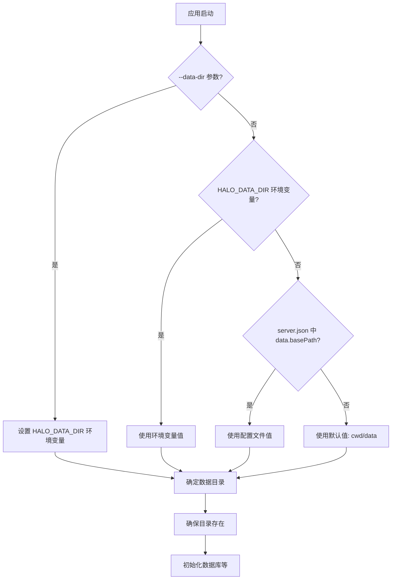

## Context

### 当前状态

Halo 应用的数据存储路径硬编码为 `~/.halo/`：

```
~/.halo/
├── halo.db           # 数据库文件
├── server.json       # 配置文件
├── logs/             # 日志目录
└── users/
    └── {user_id}/
        └── spaces/
            └── {space_id}/  # 空间目录
```

相关代码位置：
- `src/server/services/config.service.ts`: 默认 `basePath: join(homedir(), '.halo')`
- `src/server/utils/database.ts`: 数据目录 `HALO_DATA_DIR || join(homedir(), '.halo')`

### 约束条件

1. 必须支持 Docker 镜像部署
2. 数据目录应支持挂载卷以实现持久化
3. 必须支持跨平台（Windows/Linux/macOS）
4. 不能使用 `.halo` 作为子目录名
5. 需要支持环境变量和启动参数配置

### 利益相关者

- 运维人员：需要配置数据持久化
- 开发人员：需要了解新的目录结构
- 终端用户：需要迁移现有数据

## Goals / Non-Goals

**Goals:**

1. 将数据存储默认路径从 `~/.halo/` 迁移到 `{cwd}/data/`
2. 支持环境变量 `HALO_DATA_DIR` 覆盖数据目录
3. 支持启动参数 `--data-dir <path>` 指定数据目录
4. 保持配置文件与数据目录的一致性
5. 提供平滑的迁移路径

**Non-Goals:**

1. 不自动迁移现有数据（提供手动迁移脚本）
2. 不改变数据库 schema 或内部存储结构
3. 不改变 API 接口

## Decisions

### 1. 默认数据目录选择

**决策**: 使用 `{cwd}/data/` 作为默认数据目录

**理由**:
- Docker 容器中 `cwd` 通常是 `/app`，数据目录为 `/app/data/`，便于挂载
- 开发环境中 `cwd` 是项目目录，数据在项目内，便于隔离和清理
- 相对路径便于在不同环境间移植

**替代方案**:
- `/var/lib/halo/`: Linux FHS 标准，但不适合 Windows 和开发环境
- `./halo-data/`: 明确表达用途，但名称较长
- `{cwd}/.halo/`: 隐藏目录，但用户明确不希望使用 `.halo`

**最终选择**: `{cwd}/data/` - 简洁、明确、便于 Docker 挂载

### 2. 目录结构设计

**决策**: 保持现有内部结构，只改变根目录

```
{data-dir}/
├── halo.db           # 数据库文件
├── halo.db-wal       # WAL 日志（SQLite）
├── halo.db-shm       # 共享内存文件（SQLite）
├── server.json       # 配置文件（可选）
├── logs/             # 日志目录
│   ├── server-{date}.log
│   └── api-{date}.log
└── users/
    └── {user_id}/
        ├── config/   # 用户配置
        └── spaces/
            └── {space_id}/
                ├── .claude/
                └── ...
```

**理由**:
- 最小化变更范围
- 保持向后兼容的内部结构
- 便于用户理解和迁移

### 3. 配置优先级

**决策**: 按以下优先级解析数据目录

```
1. 启动参数 --data-dir <path>        (最高优先级)
2. 环境变量 HALO_DATA_DIR
3. 配置文件 data.basePath
4. 默认值 {cwd}/data/                (最低优先级)
```

**理由**:
- 命令行参数最灵活，适合调试和临时覆盖
- 环境变量适合 Docker 部署和 CI/CD
- 配置文件适合固定配置
- 默认值保证开箱即用

### 4. 配置文件位置

**决策**: 配置文件 `server.json` 默认放在数据目录内

**搜索顺序**:
```
1. 环境变量 HALO_CONFIG_PATH 指定的路径
2. {data-dir}/server.json
3. {cwd}/server.json
4. ~/.halo/server.json (向后兼容，废弃)
```

**理由**:
- 配置与数据放在一起，便于管理
- 支持多个实例独立配置
- 保持向后兼容性

### 5. 启动参数解析

**决策**: 在应用入口添加命令行参数解析

```typescript
// src/server/index.ts
import { parseArgs } from 'util'

const { values } = parseArgs({
  options: {
    'data-dir': {
      type: 'string',
      short: 'd'
    },
    'config': {
      type: 'string',
      short: 'c'
    }
  },
  strict: false
})

if (values['data-dir']) {
  process.env.HALO_DATA_DIR = values['data-dir']
}
```

**理由**:
- Node.js 18+ 内置 `util.parseArgs`，无需额外依赖
- 与环境变量机制无缝集成

## Architecture

### 模块依赖关系

```
┌─────────────────────────────────────────────────────────┐
│                     CLI / Entry Point                    │
│  parseArgs() → set HALO_DATA_DIR env                    │
└────────────────────────┬────────────────────────────────┘
                         │
                         ▼
┌─────────────────────────────────────────────────────────┐
│                    Config Service                        │
│  resolveDataDir() → loadConfig() → applyEnvOverrides()  │
└────────────────────────┬────────────────────────────────┘
                         │
          ┌──────────────┼──────────────┐
          ▼              ▼              ▼
┌─────────────┐  ┌─────────────┐  ┌─────────────┐
│  Database   │  │   Spaces    │  │    Logs     │
│  Utils      │  │   Service   │  │   Service   │
└─────────────┘  └─────────────┘  └─────────────┘
```

### 数据目录解析流程



## Risks / Trade-offs

### 风险 1: 现有数据迁移

**风险**: 用户现有数据在 `~/.halo/`，迁移后无法自动找到

**缓解措施**:
- 提供迁移脚本 `scripts/migrate-data-dir.js`
- 首次启动时检测旧数据目录，输出迁移提示
- 文档中明确说明迁移步骤

### 风险 2: 相对路径解析错误

**风险**: 使用相对路径时，`cwd` 不正确导致数据目录错误

**缓解措施**:
- 在日志中明确输出解析后的绝对路径
- 文档中建议使用绝对路径或从正确目录启动

### 风险 3: 多实例数据冲突

**风险**: 多个实例使用相同数据目录导致数据库锁定

**缓解措施**:
- 日志中明确输出数据目录路径
- 文档中说明多实例部署需配置不同数据目录
- 考虑添加锁文件检测机制

### 风险 4: Docker 卷挂载配置错误

**风险**: Docker 用户挂载错误目录导致数据丢失

**缓解措施**:
- 提供标准 Dockerfile 和 docker-compose.yml 示例
- 文档中明确说明挂载点为 `/app/data`
- 启动日志中输出数据目录路径

## Migration Plan

### 阶段 1: 代码修改

1. 修改 `config.service.ts` 的默认数据目录
2. 修改 `database.ts` 的数据目录解析逻辑
3. 添加启动参数解析
4. 更新日志、空间管理等模块的路径引用

### 阶段 2: 迁移工具

1. 创建 `scripts/migrate-data-dir.js` 脚本
2. 脚本功能：
   - 检测旧数据目录 `~/.halo/`
   - 复制到新目录 `{cwd}/data/`
   - 生成迁移报告

### 阶段 3: 文档更新

1. 更新 `openspec/config.yaml` 数据存储描述
2. 更新 README 部署说明
3. 创建 Docker 部署指南

### 回滚策略

- 保留环境变量 `HALO_DATA_DIR=~/.halo` 兼容方案
- 用户可设置环境变量指向旧目录
- 迁移脚本支持双向迁移

## Open Questions

1. **是否需要支持配置文件与数据目录分离？**
   - 当前设计将配置放在数据目录内
   - 可考虑支持 `--config` 参数指定独立配置文件路径
   - 建议：初期保持简单，根据用户反馈迭代

2. **日志目录是否应该独立配置？**
   - 当前日志在 `{data-dir}/logs/`
   - Docker 场景可能希望日志输出到 stdout 或独立挂载
   - 建议：支持 `HALO_LOG_DIR` 环境变量覆盖

3. **是否需要检测并提示旧数据目录？**
   - 可以在启动时检测 `~/.halo/` 是否存在
   - 存在则输出迁移提示
   - 建议：添加此功能，提升用户体验
